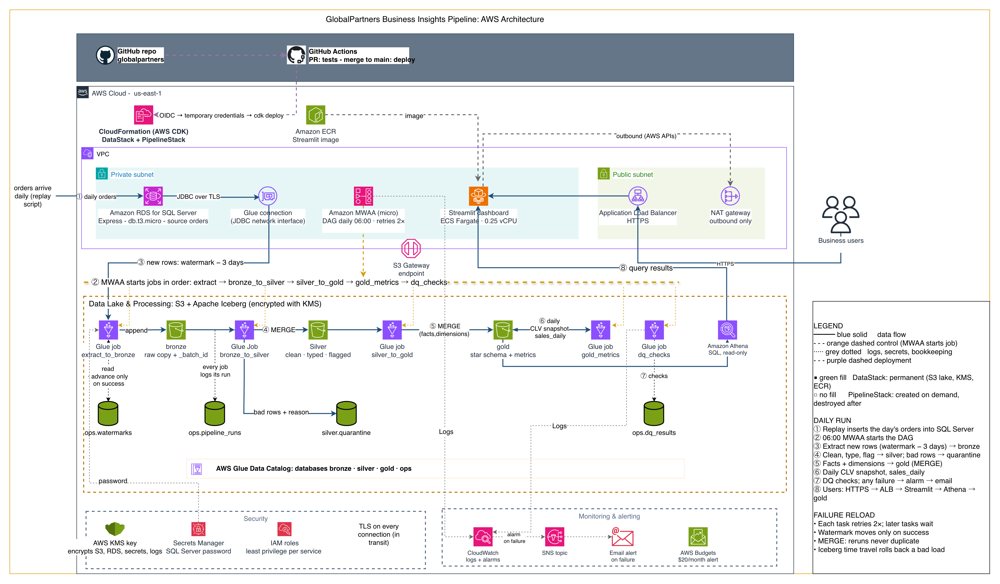
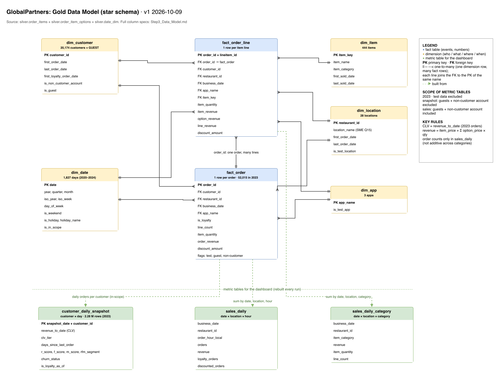

# Step 3: Solution Design

GlobalPartners Business Insights Pipeline. Version 1.0 for SME approval, 2026-10-10.
Prepared by Polat.

**What you are asked to approve:** the pipeline architecture (section 3), the data model
(section 5) and the way the business rules are applied (section 6). Open questions with working
assumptions are listed in section 12; answering them does not change the design.

| Document | Content |
|---|---|
| This document | Design overview and requirement-by-requirement explanation |
| [`global-partner-pipeline-architecture.png`](global-partner-pipeline-architecture.png) | Pipeline architecture diagram |
| [`global-partner-data-model.png`](global-partner-data-model.png) | Gold data model (star schema) diagram |
| [`Step3_Data_Model.md`](Step3_Data_Model.md) | Column-by-column specification of every table |
| [`cost_estimate.md`](cost_estimate.md) | AWS cost estimate and cost controls |
| [`../../config/business_rules.yaml`](../../config/business_rules.yaml) | Business rules applied by the pipeline |
| [Step 1](../01_data_verification/Step1_Data_Verification_Findings.md) and [Step 2](../02_data_analysis/Step2_Initial_Data_Analysis.md) reports | Data verification and analysis that this design is based on |

---

## 1. Purpose and scope

Build a pipeline that gives GlobalPartners one consistent view of customer behaviour, spend and
business performance, with **Customer Lifetime Value (CLV) recalculated every day** as the primary
metric, and the Step 5 metrics (CLV tiers, RFM segments, churn indicators, sales trends, loyalty
impact, location performance, discount effectiveness) available to a Streamlit dashboard.

| Scope item | Value |
|---|---|
| Reporting period | **2023 orders** (SME confirmed) |
| Business day | Order time converted from UTC to `America/New_York` (assumption, Q10) |
| Test data | `Alltown Fresh - DEVELOPMENT` orders excluded from all metrics (SME confirmed) |
| 2023 in scope | **52,015 orders, $746,223.86 revenue, 20 locations** |
| Customers in customer metrics | **10,512** (guest orders and the non-customer account excluded) |

---

## 2. Requirements and how each is met

| Requirement (requirements document) | How the design meets it | Section |
|---|---|---|
| Source is SQL Server; data is pulled from database tables | Amazon RDS for SQL Server Express; the pipeline reads it over JDBC | 3, 4 |
| AWS resources only; no new licenses; no Snowflake, dbt or other external tools | Every component is an AWS service; SQL Server Express is license-included in RDS; GitHub is used for CI/CD as the plan requires | 3 |
| All logic in PySpark | Every extract, transformation, metric and data-quality check is a PySpark job on AWS Glue | 3, 4 |
| Scheduling | Apache Airflow on Amazon MWAA runs the pipeline daily at 06:00 | 3, 8 |
| Encryption | At rest: AWS KMS key on S3, RDS, secrets and logs. In transit: TLS on every connection. Database password in AWS Secrets Manager | 7 |
| Failure reload mechanism | Automatic retries; a load bookmark that only advances on success; MERGE writes that never duplicate; table versions that can be rolled back | 8 |
| Data model showing how CLV evolves for each customer daily (primary goal) | `customer_daily_snapshot`: one row per customer per day with CLV to date, tier, RFM segment and churn status | 5 |
| Data model supports the Step 5 metrics (secondary goal) | Star schema plus sales aggregates; section 5.4 maps every metric to its table | 5 |
| Interactive dashboard in Streamlit | Streamlit on Amazon ECS Fargate, reading the gold tables through Amazon Athena | 3 |
| CI/CD via GitHub | GitHub Actions runs tests on every pull request and deploys on merge to `main` | 9 |

---

## 3. Architecture

### Components

| Component | AWS service | Role |
|---|---|---|
| Source database | Amazon RDS for SQL Server Express | Holds `order_items`, `order_item_options`, `date_dim`. A replay task loads each day's orders from the seed files to simulate live trading |
| Network | Amazon VPC, private subnets, S3 gateway endpoint | The database and compute have no internet exposure; data reaches S3 privately |
| Transformation | AWS Glue 5.1 (PySpark) | Five jobs: extract, bronze → silver, silver → gold, gold metrics, data-quality checks |
| Data lake | Amazon S3 with Apache Iceberg tables | Bronze, silver, gold and ops tables; reliable writes (MERGE), version history |
| Catalog | AWS Glue Data Catalog | Registers every table so jobs and Athena use them by name |
| Orchestration | Amazon MWAA (Apache Airflow) | Daily schedule, task order, retries |
| Query | Amazon Athena | SQL access to gold tables for the dashboard and for checking data |
| Dashboard | Streamlit on Amazon ECS Fargate behind an Application Load Balancer (HTTPS) | Interactive dashboards; read-only access to gold |
| Security | AWS KMS, AWS Secrets Manager, IAM roles | Encryption keys, database password, least-privilege permissions |
| Monitoring | Amazon CloudWatch, Amazon SNS, AWS Budgets | Logs, alarms, failure emails, spend alerts |
| Deployment | GitHub Actions, AWS CDK, AWS CloudFormation | Infrastructure and code deployed from the repository |

### One day of the pipeline

1. During the day, orders arrive in SQL Server (simulated by the replay task).
2. At 06:00 Airflow starts the daily run.
3. **Extract:** new and changed orders since the last successful load (with a 3-day safety window
   for late-arriving rows) are copied to the **bronze** layer, together with their options.
4. **Bronze → silver:** values are typed and cleaned, rows are flagged (guest, test data,
   non-customer account), broken rows are set aside in quarantine with a reason.
5. **Silver → gold:** order facts and dimensions are updated.
6. **Gold metrics:** the daily CLV snapshot and the sales aggregates are rebuilt.
7. **Data-quality checks:** row counts and revenue totals must reconcile across layers. If any
   check fails, the run fails, an alert email is sent, and the dashboard keeps the last good data.
8. Users open the dashboard (HTTPS → Streamlit → Athena → gold tables).

---

## 4. Data flow

| Layer | Content | How it is written |
|---|---|---|
| **Bronze** | Exact copy of the source rows, as received, plus batch id and load time | Appended |
| **Silver** | Cleaned, typed and flagged copy of each source table; nothing removed for business reasons | MERGE (insert new, update changed) |
| **Gold** | Star schema, daily CLV snapshot, sales aggregates | Facts: MERGE; dimensions and metric tables: rebuilt each run |
| **Ops** | Load bookmarks (`ops.watermarks`), run log (`ops.pipeline_runs`), check results (`ops.dq_results`) | Written by every run |

**Incremental loading.** Each run reads orders created after the last successful load minus three
days. Options have no timestamp of their own, so they are read through their parent orders; a
line and its options always arrive together. Rows re-read by the safety window are matched by key,
so they never create duplicates.

**Quarantine instead of failure.** A row that cannot be used (missing key, unreadable timestamp,
invalid price or quantity) is moved to `silver.quarantine` with every reason it failed, and the run
continues. No 2023 row fails these rules today; they protect future loads.

**Data-quality checks** (final step of every run):

| Check | Purpose |
|---|---|
| Row counts reconcile from source to bronze to silver (+ quarantine) | No rows lost during a load |
| Revenue ties out: orders = order lines = sales aggregates = $746,223.86 for 2023 | No rows dropped or doubled by joins |
| Keys unique and never empty | Reruns did not duplicate rows |
| Every fact row finds its date, customer, location, item and app | Dimensions are complete |
| Quarantine rate below 1 % of a batch | Detects a format change in the source |
| Loyalty card present ⇔ loyalty flag true | Detects inconsistent loyalty data |

---

## 5. Data model

Full column specifications: [`Step3_Data_Model.md`](Step3_Data_Model.md).

### 5.1 Star schema

| Table | One row per | Used for |
|---|---|---|
| `fact_order_line` | item line | Category and item analysis; revenue at line level |
| `fact_order` | order | Order counts, average order value, loyalty comparison, discounts |
| `dim_customer`, `dim_location`, `dim_item`, `dim_app`, `dim_date` | customer, location, item, app, calendar day | Describing and filtering the facts |

Revenue per line = `item_price` (the line total, SME confirmed) + Σ (`option_price` × `item_quantity`)
(assumption, Q3).

### 5.2 Daily CLV: `customer_daily_snapshot`

One row per customer per day, from the customer's first 2023 order to the latest loaded day,
including days without orders (because recency and churn status change on those days too).
For 2023: **2,283,740 rows, 10,512 customers, $673,614.04 total CLV at year end.**

| What each row holds | Definition |
|---|---|
| CLV to date | Total 2023 spend up to that day |
| CLV tier | Customers ranked by CLV every day: **High** = top 20 %, **Low** = bottom 20 %, **Medium** = the rest. Customers with equal CLV share a tier |
| Recency, frequency, monetary | Days since last order; orders and spend in the last 90 days |
| RFM segment | **VIP**, **New**, **Churn Risk** or **Regular** (rules in section 6) |
| Churn indicators | Days since last order, average days between orders, spend in the last 30 days vs the previous 30 |
| Churn status | **active** ≤ 45 days since last order, **at risk** 46–90, **lapsed** > 90 (assumption, Q13) |
| Loyalty | Loyalty status as of that day (taken from the customer's latest order) |

Example, a real 2023 customer:

| Date | CLV to date | Segment | Status |
|---|---|---|---|
| 8 May | $12.99 | New | active |
| 25 Jun | $12.99 | Churn Risk | at risk |
| 26 Jun | $34.97 | VIP | active |
| 23 Oct | $74.94 | VIP | active |
| 31 Dec | $74.94 | Churn Risk | at risk |

Customer tiers at 31 Dec 2023: High 2,103 (CLV ≥ $75.93), Medium 6,604, Low 1,805 (CLV ≤ $10.98).

### 5.3 Sales aggregates

| Table | One row per | Measures |
|---|---|---|
| `sales_daily` | day × location × hour | orders, revenue, item quantity, loyalty orders and revenue, guest orders, discounted orders |
| `sales_daily_category` | day × location × menu category | revenue, item quantity, lines |

They are separate because 24.5 % of 2023 orders contain items from more than one category: revenue
can be split by category, but an order cannot be counted once per category.

### 5.4 Where each Step 5 metric comes from

| Metric | Table(s) |
|---|---|
| CLV and CLV tiers (High / Medium / Low) | `customer_daily_snapshot` |
| RFM segments | `customer_daily_snapshot` |
| Churn indicators and at-risk customers | `customer_daily_snapshot` |
| Sales trends (daily, weekly, monthly; by location, category, time of day) | `sales_daily`, `sales_daily_category`, `dim_date` |
| Loyalty members vs non-members | `fact_order`, `customer_daily_snapshot` |
| Best and worst locations (revenue, average order value, orders per day/week) | `sales_daily`, `dim_location` |
| Discount effectiveness | `fact_order`, `sales_daily` (see section 11) |

---

## 6. Business rules

All business rules live in one file, [`config/business_rules.yaml`](../../config/business_rules.yaml).
Changing a rule there changes the results on the next run without changing code; every rule
records whether it is an SME decision or an assumption.

| Rule | Value | Source |
|---|---|---|
| Reporting period | 2023 | SME confirmed |
| Test data | `Alltown Fresh - DEVELOPMENT` excluded | SME confirmed |
| `Alltown Neighborhood Perks` app | included | SME confirmed (Q6) |
| Location | `restaurant_id` is the location | SME confirmed (Q1) |
| Line revenue | `item_price` is the line total | SME confirmed (Q2) |
| Guest orders (4,492 orders, $60,247) | excluded from customer metrics, included in sales and location totals | SME confirmed (Q4) |
| Account `5ece77fe902ad501337b23fd` (937 orders, $12,362) | excluded from customer metrics; revenue kept in sales | SME confirmed faulty account, the only one (Q11); revenue treatment assumed (Q11a) |
| Option revenue | `option_price` × `item_quantity` | assumption (Q3) |
| Business day | `America/New_York` | assumption (Q10) |
| CLV tiers | High top 20 %, Low bottom 20 % | requirements document |
| RFM window | 90 days | design |
| RFM scores (5 = best) | Recency: ≤ 7 / 30 / 45 / 90 days. Frequency: ≥ 6 / 3 / 2 / 1 orders. Monetary: > $60 / ≥ $30 / ≥ $15 / > $0 | design |
| RFM segments (first match wins) | VIP: R, F, M all ≥ 4. New: R ≥ 4, F ≤ 2, first order within 90 days. Churn Risk: R ≤ 2, F ≤ 2. Regular: everyone else | requirements document wording |
| Churn status | active ≤ 45 days, at risk 46–90, lapsed > 90 | assumption (Q13) |

Fixed RFM score bands are used instead of equal-sized groups because 82.5 % of customers have 0 or
1 orders in any 90-day window, so equal groups are impossible, and fixed bands mean a score has the
same meaning every day.

### Data corrections applied in the pipeline

| Issue found in Steps 1–2 | Correction |
|---|---|
| Timestamps in four formats (with and without fractions of a second) | Parsed with one explicit format that covers all four |
| Dates in `date_dim` written day-first (`DD-MM-YYYY`) | Parsed with an explicit day-first format |
| Admin URLs pasted into `item_category` (96 rows in 2023) | URL fragment removed; every repaired value is an existing category; repaired rows are flagged |
| Item names with different capitalisation or extra spaces | Spaces normalised; a lowercase key groups spellings of the same item |
| Week number in `date_dim` is the ISO week (1–2 Jan 2023 belong to week 52) | Kept as ISO week together with the ISO year, so weekly views are correct |
| Customers' loyalty status changes over time (18 % of 2023 customers) | Loyalty is recorded per order and per day, not as a fixed customer attribute |

---

## 7. Security

| Control | Implementation |
|---|---|
| Encryption at rest | One customer-managed AWS KMS key encrypts S3, RDS, Secrets Manager and logs |
| Encryption in transit | TLS on every connection, including the database connection (`encrypt=true`) and the dashboard (HTTPS) |
| Secrets | The database password is stored in AWS Secrets Manager and read at run time; never in code or GitHub |
| Network | Database and compute in private subnets; S3 reached through a private endpoint |
| Least privilege | Each service has its own IAM role with only the permissions it needs; the dashboard can only read gold tables |
| Deployment credentials | GitHub authenticates to AWS with short-lived OIDC tokens; no AWS keys are stored in GitHub |
| Sensitive data | The loyalty card number stays in the silver layer and never reaches gold or the dashboard |

---

## 8. Operations and failure recovery

| Situation | What happens |
|---|---|
| Daily schedule | Airflow starts the run at 06:00; tasks run in order |
| A task fails | Airflow retries it twice; later tasks wait |
| The run still fails | A CloudWatch alarm sends an email through SNS; the dashboard keeps showing the last good data |
| Recovery | The load bookmark only advances after a successful run, so the next run automatically re-reads everything the failed run missed. MERGE writes mean nothing is duplicated |
| A bad load is discovered later | Iceberg keeps earlier versions of every table; a table can be rolled back to its state before the bad load |
| Tracing a number | Every row carries its batch id; `ops.pipeline_runs` records each run's row counts and status |
| Unexpected spend | AWS Budgets alert at $20/month and Cost Anomaly Detection |

---

## 9. Development and deployment

| Item | Design |
|---|---|
| Local first | The whole pipeline is built and tested on a laptop with Docker images of the same components AWS runs: SQL Server 2022 Developer, AWS Glue 5.1, the official MWAA image, Streamlit. Only configuration differs between local and AWS |
| Infrastructure as code | AWS CDK (Python), deployed through CloudFormation with automatic rollback |
| Two stacks | **DataStack** (permanent: data lake, encryption key, container registry) and **PipelineStack** (everything billed by the hour), deployed for testing and demonstrations and removed afterwards |
| CI/CD | GitHub Actions: tests on every pull request; deploy on merge to `main` |
| Region | AWS us-east-1 |
| Replay | A full replay of 2023 runs locally; on AWS, one initial full load plus a short daily replay demonstrates daily-evolving CLV |
| Final check | The pipeline runs unattended on AWS for one week before submission |

---

## 10. Cost

| Phase | Estimated cost |
|---|---|
| Local development | $0 |
| AWS, working month (about 40 hours deployed) | about $22 |
| AWS, idle month (data kept, compute removed) | about $2 |
| One always-on week before submission | about $71 (once) |

Prices are AWS list prices for us-east-1. Details and the alternatives considered:
[`cost_estimate.md`](cost_estimate.md).

---

## 11. Known limitations

| Limitation | Effect | Option for a production rollout |
|---|---|---|
| Discounts | The requirements identify discounts as negative option prices; no 2023 order has one, so discount analysis shows no discounted orders until Q7 is answered | Apply the rule the SME provides (configuration and transformation rule, no redesign) |
| Deleted orders | Orders deleted in SQL Server are not detected by the incremental load | SQL Server change data capture (Q16) |
| Late-added options | Options added more than three days after an order would be missed | Widen the safety window or add a timestamp at the source (Q16) |
| Location names | The source has location ids only; dashboards show ids | Add names to `dim_location` if they become available |
| High availability | Single-AZ database, no formal service levels | Multi-AZ RDS, defined SLAs and on-call for a production rollout |

---

## 12. Open questions

Each question has a working assumption already built into the design. An answer changes a setting
in `config/business_rules.yaml` or a single transformation rule; none changes the architecture.

| # | Question | Working assumption |
|---|---|---|
| Q13 | Churn: under "> 45 days = at risk", 77 % of 2023 customers (8,103 of 10,512) are at risk at year end. Use three statuses: active ≤ 45 days (2,409), at risk 46–90 (1,553), lapsed > 90 (6,550)? | yes |
| Q7 | How are discounts or promotions recorded? No 2023 order has a negative option price | none; analysis stays empty |
| Q11a | Are the 937 orders ($12,362) of account `5ece77fe…` real sales wrongly attached to one account, or orders that never happened? | real sales; revenue kept |
| Q3 | Is `option_price` charged per unit (× quantity) or once per line? 2023 difference: $2,739.90 (0.37 %) | per unit |
| Q10 | Which time zone defines the business day? | America/New_York |
| Q16 | Are orders ever edited or deleted after they are placed, and can options be added days later? | no deletes; changes within 3 days |
| Q8 | One menu item was sold at $0 in 2023: comp, reward or discount? | a normal sale at $0 |

---

## 13. Approval

| Name | Role | Decision | Date | Comments |
|---|---|---|---|---|
| | Subject Matter Expert | ☐ Approved ☐ Approved with changes ☐ Not approved | | |

Step 4 (building the pipeline on AWS) starts after written approval.
